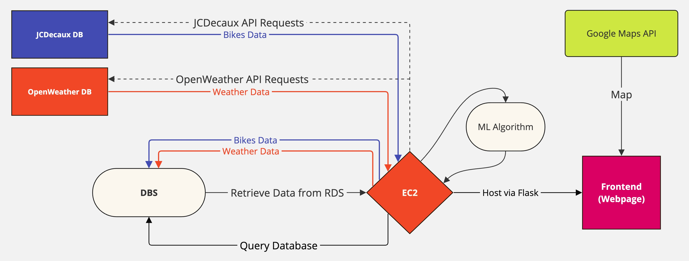

# Application Description

This application functions to display real-time and historical data accessed via the JCDecaux public bikes API and overlay that information on a map. The application also will access real-time weather information via the OpenWeather API, and combined with data relating to usage
and availability of bikes, this weather data will be used to implement an ML model to predict usage trends.

The RDS and EC2 server is hosted with AWS.
Data stored in the RDS will be managed with MySQL.

## General Description of System Layout

1. EC2 server runs a python script at 5-minute intervals to request data from both JCDecaux and OpenWeather - data retrived in JSON format.
2. EC2 runs python script that converts the data to a format suitable for creating an SQL table in the RDS.
3. Tables are created in the RDS via connection to the RDS.
4. The most up-to-date real-time data is displayed, with some UI modifications, on the webpage, overlayed on a Google Maps embed.

# Overview of development tasks

## Backend

1. Create python script to make requests with the JCDecaux and OpenWeather APIs to access relevant data (in JSON format). This is a script that will be run at a set interval (5 mins) to update data to be available to the user.
2. Create second python script that contains functions for the creation and modification of a RD with the format of data provided by the first script. The second script includes functions to parse the JSON file generated by the first script. This data is then appended to the database.
3. Set up RDS and access with databases creation/modification functions.
4. Set up python scripts (scraper, parser+database updater) on AWS EC2 instance. Configure crontab to run scripts at necessary intervals.
5. Host python data request script on Flask for use by frontend.

## Frontend

